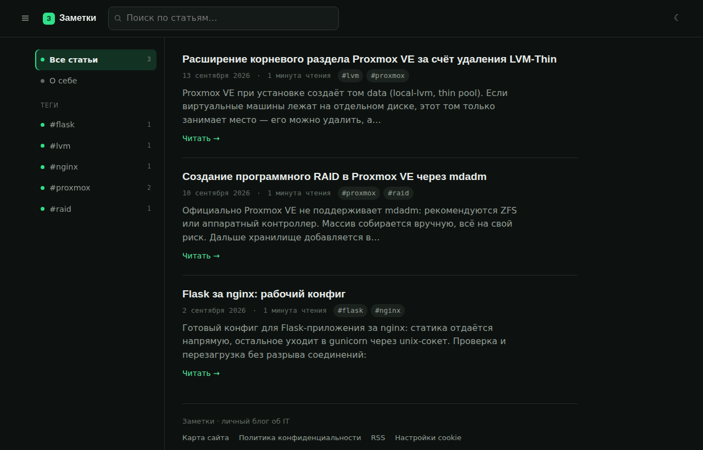
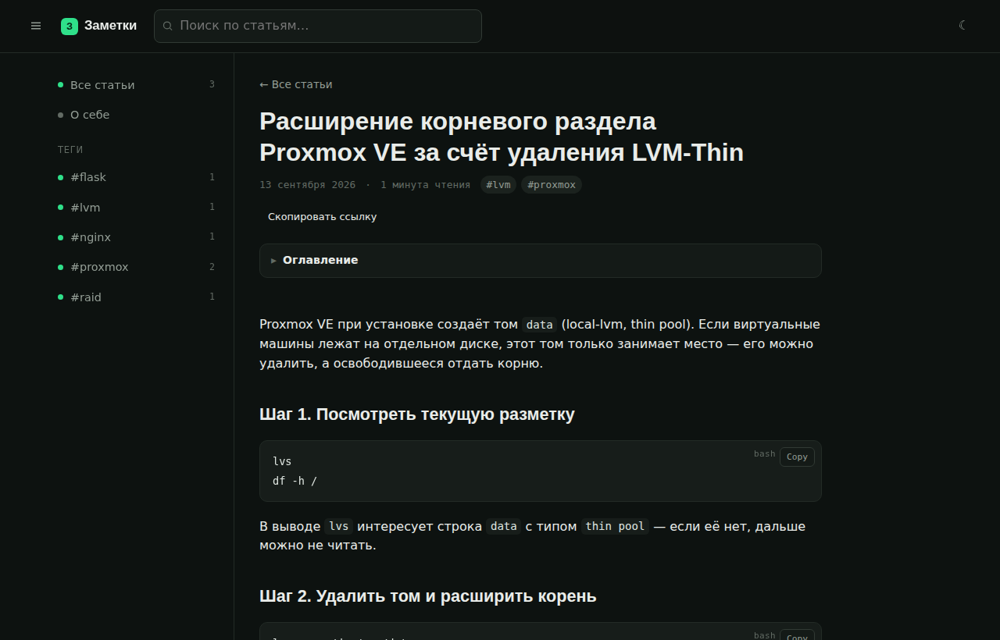
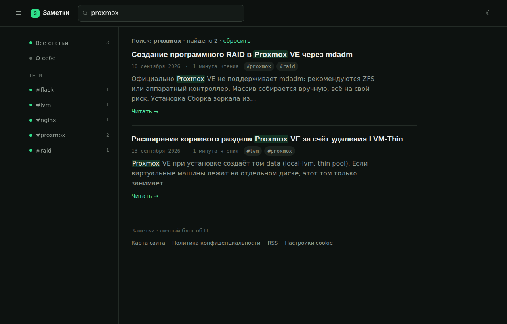
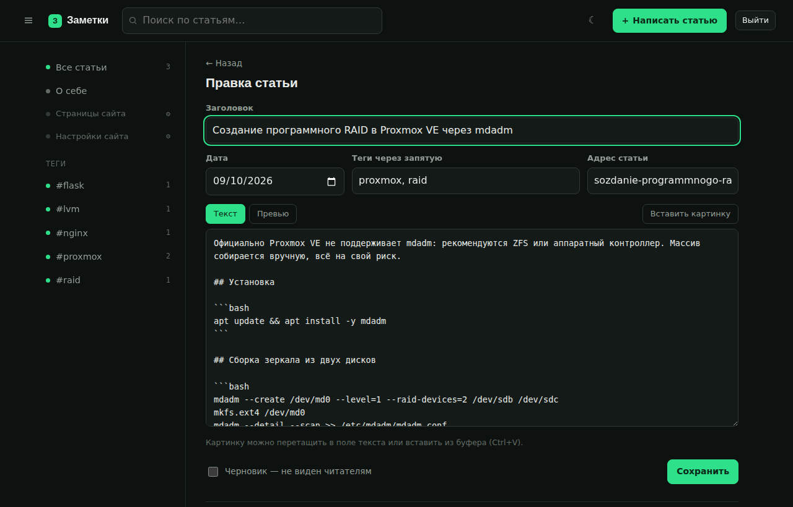
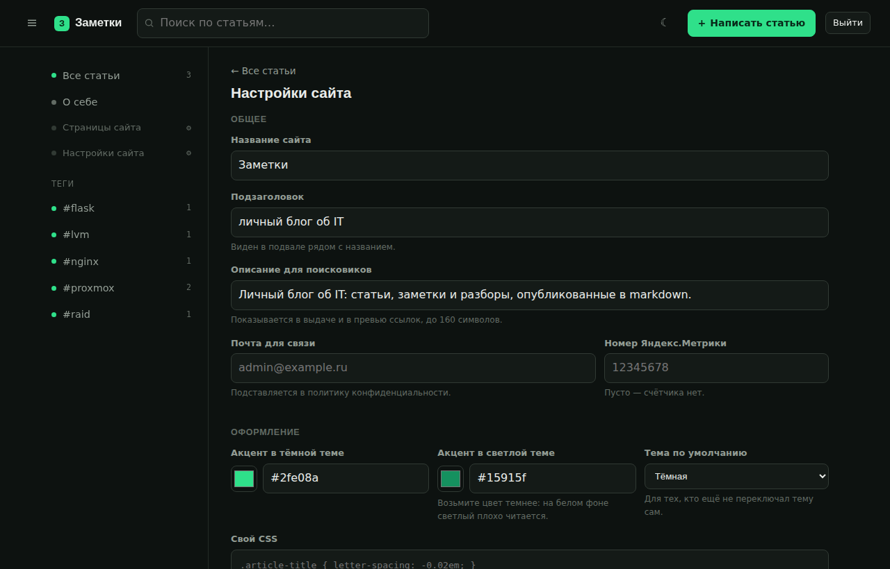

# hashpen

Движок личного блога: Flask, SQLite, статьи в markdown. Без админ-панели на пятьсот настроек, без плагинов и без базы на отдельном сервере — один процесс Python и один файл базы.

Написан для себя, работает на [worldnotes.ru](https://worldnotes.ru). Весь код — около полутора тысяч строк, которые реально прочитать за вечер.

Название — из двух вещей, на которых всё держится: решётка заголовка в markdown (`## Раздел`) и перо.



## Что умеет

- **Статьи в markdown** — рендер на сервере, оглавление собирается само, время чтения и отрывок считаются при сохранении.
- **Подсветка кода** — highlight.js, кнопка Copy и метка языка в углу блока. Без явного языка код остаётся моноширинным текстом: угадывание отключено намеренно.
- **Поиск** — полнотекстовый, на SQLite FTS5. В результатах показывается фрагмент вокруг совпадения, найденное подсвечено.
- **Теги** с фильтрацией через сайдбар.
- **Отдельные страницы** вроде «О себе» — по коротким адресам `/about`, с выбором, показывать ли их в меню.
- **Черновики** — видны только автору, помечены плашкой.
- **Картинки** — загрузка перетаскиванием, из буфера или кнопкой; тип проверяется по содержимому файла.
- **Вход с двухфакторной аутентификацией** — пароль и код из приложения-аутентификатора, резервные коды, защита от подбора.
- **Настройки в админке** — название, описание, цвет акцента, тема по умолчанию, счётчик Метрики и своё поле CSS.
- **Тёмная и светлая тема**, мобильный сайдбар, RSS, `sitemap.xml`, Open Graph для превью ссылок.
- **Cookie-баннер** по 152-ФЗ: счётчик аналитики грузится только после согласия.

## Как выглядит

| Статья | Поиск |
|---|---|
|  |  |

| Редактор | Настройки |
|---|---|
|  |  |

## Быстрый старт

Нужен Python 3.10 или новее.

```bash
git clone https://github.com/xor0x1/hashpen.git
cd hashpen
python3 -m venv .venv && . .venv/bin/activate
pip install -r requirements.txt
cp .env.example .env          # поставьте SESSION_COOKIE_SECURE=0 и свой SECRET_KEY
flask --app wsgi run
```

Сайт откроется на http://127.0.0.1:5000, база создастся сама.

Чтобы зайти в админку, задайте пароль и второй фактор:

```bash
python setup-auth.py          # запишет всё в .env и покажет QR-код
```

## Установка на сервер

На чистой Ubuntu — одной командой из папки проекта:

```bash
sudo bash install.sh
```

Скрипт спросит домен, название сайта и имя службы, а дальше сделает всё сам: пакеты, системный пользователь, окружение Python, `.env` со случайным ключом, база, служба systemd, конфиг nginx со статикой и картинками, ежедневный бэкап. В конце напечатает две оставшиеся команды — настройку входа и выпуск сертификата.

Повторный запуск безопасен: `.env` и база не перезаписываются. Подробности и ручная установка — в [docs/deploy.md](docs/deploy.md).

## Наполнение

Статьи пишутся прямо на сайте, но пачку готовых файлов можно загрузить командой:

```bash
flask --app wsgi import-md ./articles     # все .md из папки
```

Формат файла — в [examples/primer-stati.md](examples/primer-stati.md): необязательный блок с заголовком, датой и тегами, дальше текст.

## Что внутри

```
app/
  __init__.py   сборка приложения и настройки
  content.py    markdown → HTML, оглавление, отрывок, время чтения
  models.py     статьи, страницы, теги, поиск
  settings.py   настройки сайта из админки
  auth.py       вход, TOTP, CSRF, защита от подбора
  admin.py      редактор, загрузка картинок
  views.py      публичные страницы, RSS, sitemap
  migrations.py версии схемы базы
  cli.py        команды импорта и обслуживания
```

Зависимостей четыре: Flask, markdown-it-py, python-dotenv, PyYAML. Плюс gunicorn на сервере. Ни ORM, ни сборщика фронтенда, ни Node.

Схема базы версионируется через `PRAGMA user_version`: приложение само доводит базу до актуальной версии при запуске, вручную — `flask --app wsgi db-upgrade`.

Подробное руководство по всем возможностям — в [docs/manual.md](docs/manual.md).

## Чего здесь нет

Осознанно: нескольких пользователей и ролей, плагинов, визуального редактора, комментариев, мультиязычности, переключаемых тем, кеширования. Это движок для одного автора, который пишет в markdown. Если нужен полноценный сайт с магазином и формами — берите WordPress, это честнее.

## Лицензия

Business Source License 1.1 — см. [LICENSE](LICENSE).

Коротко и без юридических формулировок: кодом можно свободно пользоваться, изучать и дорабатывать, в том числе для своих сайтов и сайтов своей организации. Нельзя строить на нём платный сервис для чужих сайтов без отдельной договорённости с автором. Через четыре года после публикации версии её код автоматически переходит под открытую лицензию.
